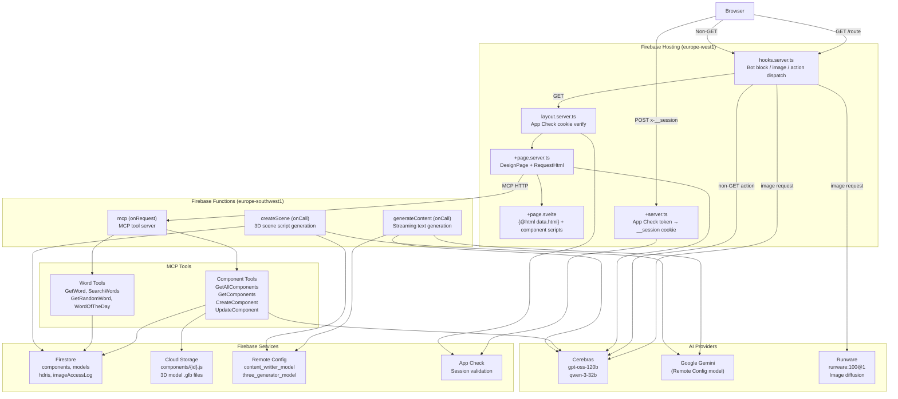
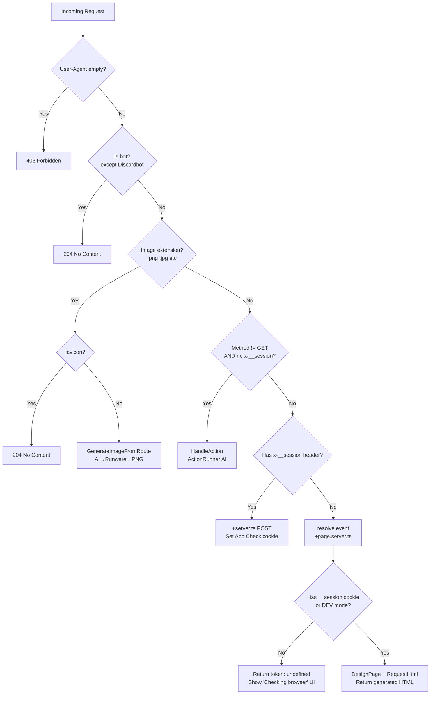
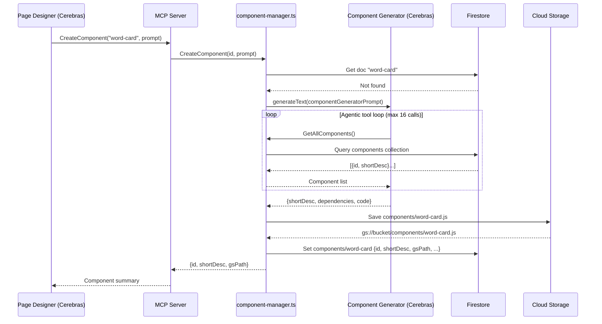
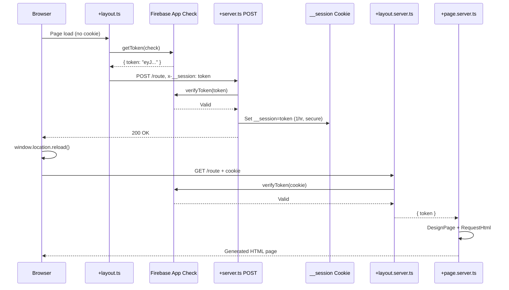

# Architecture Diagrams (Mermaid)

## Full System Architecture

```mermaid
graph TB
    Browser["Browser"]

    subgraph Firebase_Hosting["Firebase Hosting (europe-west1)"]
        Hooks["hooks.server.ts\nBot block / image / action dispatch"]
        Layout["layout.server.ts\nApp Check cookie verify"]
        PageServer["+page.server.ts\nDesignPage + RequestHtml"]
        PageSvelte["+page.svelte\n{@html data.html} + component scripts"]
        SlugServer["+server.ts\nApp Check token → __session cookie"]
    end

    subgraph Firebase_Functions["Firebase Functions (europe-southwest1)"]
        MCP["mcp (onRequest)\nMCP tool server"]
        GenContent["generateContent (onCall)\nStreaming text generation"]
        CreateScene["createScene (onCall)\n3D scene script generation"]
    end

    subgraph MCP_Tools["MCP Tools"]
        CompTools["Component Tools\nGetAllComponents\nGetComponents\nCreateComponent\nUpdateComponent"]
        WordTools["Word Tools\nGetWord, SearchWords\nGetRandomWord, WordOfTheDay"]
    end

    subgraph AI_Providers["AI Providers"]
        Cerebras["Cerebras\ngpt-oss-120b\nqwen-3-32b"]
        Gemini["Google Gemini\n(Remote Config model)"]
        Runware["Runware\nrunware:100@1\nImage diffusion"]
    end

    subgraph Firebase_Services["Firebase Services"]
        Firestore["Firestore\ncomponents, models\nhdris, imageAccessLog"]
        Storage["Cloud Storage\ncomponents/{id}.js\n3D model .glb files"]
        RemoteConfig["Remote Config\ncontent_writter_model\nthree_generator_model"]
        AppCheck["App Check\nSession validation"]
    end

    Browser -->|GET /route| Hooks
    Browser -->|POST x-__session| SlugServer
    Browser -->|Non-GET| Hooks

    Hooks -->|image request| Cerebras
    Hooks -->|image request| Runware
    Hooks -->|non-GET action| Cerebras
    Hooks -->|GET| Layout
    Layout --> PageServer
    PageServer --> Cerebras
    PageServer -->|MCP HTTP| MCP
    PageServer --> PageSvelte

    MCP --> CompTools
    MCP --> WordTools
    CompTools --> Cerebras
    CompTools --> Firestore
    CompTools --> Storage
    WordTools --> Firestore

    GenContent --> RemoteConfig
    GenContent --> Cerebras
    GenContent --> Gemini

    CreateScene --> RemoteConfig
    CreateScene --> Gemini
    CreateScene --> Firestore

    SlugServer --> AppCheck
    Layout --> AppCheck
```

## Request Routing Decision Tree

```mermaid
flowchart TD
    A[Incoming Request] --> B{User-Agent empty?}
    B -->|Yes| C[403 Forbidden]
    B -->|No| D{Is bot?\nexcept Discordbot}
    D -->|Yes| E[204 No Content]
    D -->|No| F{Image extension?\n.png .jpg etc}
    F -->|Yes| G{favicon?}
    G -->|Yes| H[204 No Content]
    G -->|No| I[GenerateImageFromRoute\nAI→Runware→PNG]
    F -->|No| J{Method != GET\nAND no x-__session?}
    J -->|Yes| K[HandleAction\nActionRunner AI]
    J -->|No| L{Has x-__session header?}
    L -->|Yes| M[+server.ts POST\nSet App Check cookie]
    L -->|No| N[resolve event\n+page.server.ts]
    N --> O{Has __session cookie\nor DEV mode?}
    O -->|No| P[Return token: undefined\nShow 'Checking browser' UI]
    O -->|Yes| Q[DesignPage + RequestHtml\nReturn generated HTML]
```

## Component Generation Lifecycle

```mermaid
sequenceDiagram
    participant D as Page Designer (Cerebras)
    participant MCP as MCP Server
    participant CM as component-manager.ts
    participant LLM as Component Generator (Cerebras)
    participant FS as Firestore
    participant GCS as Cloud Storage

    D->>MCP: CreateComponent("word-card", prompt)
    MCP->>CM: CreateComponent(id, prompt)
    CM->>FS: Get doc "word-card"
    FS-->>CM: Not found
    CM->>LLM: generateText(componentGeneratorPrompt)
    loop Agentic tool loop (max 16 calls)
        LLM->>CM: GetAllComponents()
        CM->>FS: Query components collection
        FS-->>CM: [{id, shortDesc}...]
        CM-->>LLM: Component list
    end
    LLM-->>CM: {shortDesc, dependencies, code}
    CM->>GCS: Save components/word-card.js
    GCS-->>CM: gs://bucket/components/word-card.js
    CM->>FS: Set components/word-card {id, shortDesc, gsPath, ...}
    CM-->>MCP: {id, shortDesc, gsPath}
    MCP-->>D: Component summary
```

## App Check Token Flow

```mermaid
sequenceDiagram
    participant B as Browser
    participant Layout as +layout.ts
    participant AppCheckSDK as Firebase App Check
    participant SlugServer as +server.ts POST
    participant Cookie as __session Cookie
    participant LayoutServer as +layout.server.ts
    participant PageServer as +page.server.ts

    B->>Layout: Page load (no cookie)
    Layout->>AppCheckSDK: getToken(check)
    AppCheckSDK-->>Layout: { token: "eyJ..." }
    Layout->>SlugServer: POST /route, x-__session: token
    SlugServer->>AppCheckSDK: verifyToken(token)
    AppCheckSDK-->>SlugServer: Valid
    SlugServer->>Cookie: Set __session=token (1hr, secure)
    SlugServer-->>B: 200 OK
    B->>B: window.location.reload()
    B->>LayoutServer: GET /route + cookie
    LayoutServer->>AppCheckSDK: verifyToken(cookie)
    AppCheckSDK-->>LayoutServer: Valid
    LayoutServer-->>PageServer: { token }
    PageServer->>PageServer: DesignPage + RequestHtml
    PageServer-->>B: Generated HTML page
```
